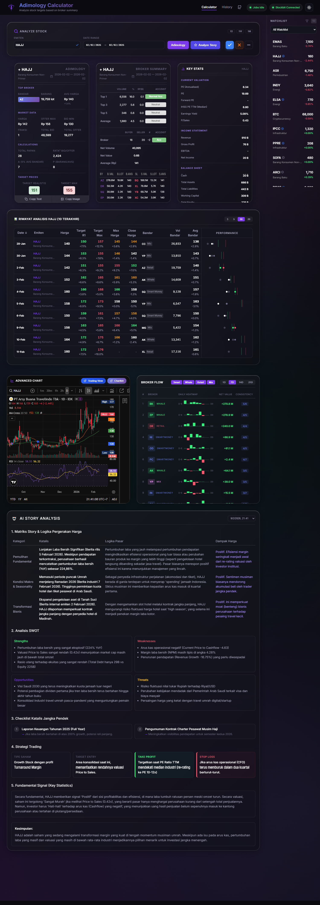

# Adimology - Kalkulator Target Saham

> [!CAUTION]
> **PERINGATAN KEAMANAN**: Jangan pernah membagikan URL aplikasi Netlify Anda secara publik. Aplikasi ini melakukan sinkronisasi token sesi Stockbit Anda ke database. Jika URL bocor, orang lain dapat menyalahgunakan akses tersebut. Meski begitu, aplikasi ini tetap tidak bisa melakukan transaksi karena tidak bisa mengakses fitur PIN. Gunakan aplikasi ini hanya untuk penggunaan pribadi.

Adimology adalah aplikasi web untuk menganalisis target harga saham berdasarkan data transaksi broker (bandarmologi) dari Stockbit. Aplikasi ini juga melacak performa analisis secara otomatis dan menyediakan data akumulasi broker.




---

💡 **Credit Rumus**: Algoritma dan rumus analisis dalam aplikasi ini didasarkan pada metodologi dari **[Adi Sucipto](https://www.instagram.com/adisuciipto/)**.

---

## Fitur Utama

- **Analisis Target**: Menghitung target harga "Realistis (R1)" dan "Maksimal" berdasarkan rata-rata harga pembelian broker (Avg Bandar).
- **Data Terintegrasi Stockbit**: Mengambil data transaksi broker summary.
- **History & Watchlist**: Menyimpan riwayat analisis untuk dipantau di kemudian hari.
- **Sync Watchlist & Hapus Otomatis**: Menampilkan watchlist langsung dari akun Stockbit termasuk fungsi delete.
- **Tracking Real Harga (H+1)**: Secara otomatis memperbarui harga riil di hari bursa berikutnya untuk memverifikasi apakah target analisis tercapai.
- **Sistem Background Job & Retry**: Pemantauan status background job (analisis otomatis) dengan tombol **Retry** untuk menjalankan ulang job yang gagal.
- **Advanced Charts (TradingView & Chartbit)**:
  - Integrasi grafis dengan **Chartbit**.
  - Integrasi **TradingView Advanced Chart** dengan indikator RSI dan Oversold untuk konfirmasi sinyal Buy/Sell. Register ke https://www.tradingview.com/ untuk bisa melihat grafiknya.
- **Filter Flag & Watchlist**: Filter cepat berdasarkan flag emiten (Big Spec, Trend, dll) dan grup watchlist untuk mempermudah pemantauan portfolio.
- **Frozen Glass Design System**: Antarmuka modern dengan gaya *Glassmorphism/Frozen Glass Material*.
- **Multi-Theme Support**: Dukungan penuh mode **Light** dan **Dark** yang sinkron dengan sistem atau preferensi pengguna.
- **Ringkasan Broker (Top 1, 3, 5)**: Visualisasi kekuatan akumulasi vs distribusi broker.
- **Export to PDF**: Unduh laporan riwayat analisis dalam format PDF yang rapi.
- **AI Story Analysis**: Analisis berita dan sentimen pasar menggunakan AI (Gemini) untuk merangkum story, SWOT, dan katalis emiten secara instan.
- **Multi-Version Analysis Tracking**: Menyimpan dan menampilkan riwayat analisis AI sebelumnya sehingga Anda bisa melacak perubahan narasi pasar dari waktu ke waktu.

---

## Tech Stack

- **Frontend**: [Next.js 15 (App Router)](https://nextjs.org/), React 19, Tailwind CSS 4.
- **Backend/Database**: [Supabase](https://supabase.com/) (PostgreSQL).
- **Deployment**: [Netlify](https://www.netlify.com/) (dengan Netlify Functions & Scheduled Functions).
- **AI Engine**: [Google Gemini Pro](https://ai.google.dev/) dengan Google Search Grounding untuk data berita terkini.
- **Tools**: `jspdf` & `html2canvas` untuk ekspor PDF, `lucide-react` untuk ikon.

---

## Pilih Opsi Instalasi

Pilih salah satu opsi instalasi yang sesuai dengan kebutuhan Anda:

| | **OPSI A: CLOUD** | 💻 **OPSI B: LOKAL** |
|---|---|---|
| **Platform** | Netlify + Supabase | PC Lokal + Supabase |
| **Akses** | Dari mana saja via URL | Hanya dari PC Anda |
| **Scheduled Functions** | ✅ Otomatis jalan | ❌ Manual trigger |
| **Biaya** | Free tier tersedia | Gratis (self-hosted) |
| **Cocok untuk** | Penggunaan harian | Development/testing |

---

# OPSI A: Deploy ke Cloud (Netlify + Supabase)

Ikuti langkah-langkah berikut secara berurutan:

## A1. Setup Supabase

1. Buat akun dan project baru di [Supabase](https://supabase.com/)
2. Catat kredensial berikut dari **Project Settings > API**:
   - `Project URL` → untuk `NEXT_PUBLIC_SUPABASE_URL`
   - `anon public` key → untuk `NEXT_PUBLIC_SUPABASE_ANON_KEY`
   - `service_role` key → untuk `SUPABASE_SERVICE_ROLE_KEY`

> **Note:** Migrasi database akan dijalankan otomatis saat build di Netlify. Anda tidak perlu menjalankan script SQL manual.

## A2. Deploy ke Netlify

1. Fork atau push repository ini ke GitHub Anda
2. Login ke [Netlify](https://www.netlify.com/) dan klik **Add new site > Import an existing project**
3. Pilih repository Adimology dari GitHub
4. Tambahkan **Environment Variables** di Netlify:

   | Variable | Nilai | Wajib |
   |----------|-------|:-----:|
   | `NEXT_PUBLIC_SUPABASE_URL` | URL dari Supabase | ✅ |
   | `NEXT_PUBLIC_SUPABASE_ANON_KEY` | Anon key dari Supabase | ✅ |
   | `SUPABASE_SERVICE_ROLE_KEY` | Service role key dari Supabase (untuk migrasi) | ✅ |
   | `CRON_SECRET` | String acak untuk keamanan cron | ✅ |
   | `GEMINI_API_KEY` | API Key dari [Google AI Studio](https://aistudio.google.com/) | ✅ |

5. Klik **Deploy site** dan tunggu hingga selesai
6. Catat URL Netlify Anda (contoh: `https://your-app.netlify.app`)

## A3. Setup Chrome Extension (untuk Cloud)

1. Buka folder `stockbit-token-extension/` di repository
2. Salin file konfigurasi:
   ```bash
   cp stockbit-token-extension/manifest.json.example stockbit-token-extension/manifest.json
   cp stockbit-token-extension/background.js.example stockbit-token-extension/background.js
   ```

3. Edit `manifest.json` - ganti `YOUR_APP_DOMAIN` dengan URL Netlify Anda:
   ```json
   "host_permissions": [
      "https://*.stockbit.com/*",
      "https://your-app.netlify.app/*"
   ]
   ```

4. Edit `background.js` - ganti `APP_API_URL` dengan URL Netlify Anda:
   ```javascript
   const APP_API_URL = "https://your-app.netlify.app/api/update-token";
   ```

5. Install ekstensi di Chrome:
   - Buka `chrome://extensions/`
   - Aktifkan **Developer mode** (pojok kanan atas)
   - Klik **Load unpacked**
   - Pilih folder `stockbit-token-extension`

## A4. Verifikasi Instalasi

1. Buka [Stockbit](https://stockbit.com/) dan login
2. Ekstensi akan otomatis menangkap dan mengirim token ke Supabase
3. Buka URL Netlify Anda
4. Cek indikator koneksi Stockbit di aplikasi - harus menunjukkan **Connected**
5. Coba analisis saham pertama Anda! 🎉

---

# OPSI B: Instalasi Lokal (PC + Supabase)

Ikuti langkah-langkah berikut secara berurutan:

## B1. Setup Supabase

> ⚠️ Langkah ini **sama dengan Opsi A**. Jika sudah setup Supabase, lanjut ke B2.

1. Buat akun dan project baru di [Supabase](https://supabase.com/)
2. Catat kredensial berikut dari **Project Settings > API**:
   - `Project URL` → untuk `NEXT_PUBLIC_SUPABASE_URL`
   - `anon public` key → untuk `NEXT_PUBLIC_SUPABASE_ANON_KEY`
   - `service_role` key → untuk `SUPABASE_SERVICE_ROLE_KEY`

> **Note:** Untuk testing lokal, Anda bisa menjalankan `npm run migrate` untuk menjalankan migrasi database.

## B2. Clone & Install

1. Clone repository:
   ```bash
   git clone https://github.com/username/adimology.git
   cd adimology
   ```

2. Install dependensi:
   ```bash
   npm install
   ```

3. Salin file environment:
   ```bash
   cp .env.local.example .env.local
   ```

4. Edit `.env.local` dan isi variabel berikut:
   ```env
   NEXT_PUBLIC_SUPABASE_URL=https://xxxxx.supabase.co
   NEXT_PUBLIC_SUPABASE_ANON_KEY=eyJhbGciOiJIUzI1NiIsInR5cCI6IkpXVCJ9...
   SUPABASE_SERVICE_ROLE_KEY=eyJhbGciOiJIUzI1NiIsInR5cCI6IkpXVCJ9...
   GEMINI_API_KEY=AIzaSy...
   ```

   | Variable | Nilai | Wajib |
   |----------|-------|:-----:|
   | `NEXT_PUBLIC_SUPABASE_URL` | URL dari Supabase | ✅ |
   | `NEXT_PUBLIC_SUPABASE_ANON_KEY` | Anon key dari Supabase | ✅ |
   | `SUPABASE_SERVICE_ROLE_KEY` | Service role key dari Supabase (untuk migrasi) | ✅ |
   | `GEMINI_API_KEY` | API Key dari [Google AI Studio](https://aistudio.google.com/) | ✅ |
   | `STOCKBIT_JWT_TOKEN` | Token manual (opsional, ekstensi lebih baik) | ❌ |

## B3. Jalankan Aplikasi

```bash
npm run dev
```

Aplikasi akan berjalan di [http://localhost:3000](http://localhost:3000)

## B3.5. Menjalankan Netlify Functions Lokal (Wajib untuk AI)

Fitur analisis AI (Story Analysis) menggunakan Netlify Functions. Untuk menjalankannya secara lokal:

1. Install Netlify CLI secara global:
   ```bash
   npm install -g netlify-cli
   ```

2. Jalankan Netlify Functions pada port 8888 (buka terminal baru):
   ```bash
   netlify functions:serve --port 8888
   ```

3. Validasi bahwa function berikut berhasil dimuat di terminal:
   - `analyze-watchlist`
   - `analyze-watchlist-background`
   - `analyze-story-background`

   > **Note**: Biarkan terminal ini tetap berjalan berdampingan dengan terminal aplikasi utama (`npm run dev`).

## B4. Setup Chrome Extension (untuk Lokal)

1. Buka folder `stockbit-token-extension/` di repository
2. Salin file konfigurasi:
   ```bash
   cp stockbit-token-extension/manifest.json.example stockbit-token-extension/manifest.json
   cp stockbit-token-extension/background.js.example stockbit-token-extension/background.js
   ```

3. Edit `manifest.json` - konfigurasi untuk localhost:
   ```json
   "host_permissions": [
      "https://*.stockbit.com/*",
      "http://localhost:3000/*"
   ]
   ```

4. Edit `background.js` - set `APP_API_URL` ke localhost:
   ```javascript
   const APP_API_URL = "http://localhost:3000/api/update-token";
   ```

5. Install ekstensi di Chrome:
   - Buka `chrome://extensions/`
   - Aktifkan **Developer mode** (pojok kanan atas)
   - Klik **Load unpacked**
   - Pilih folder `stockbit-token-extension`

## B5. Verifikasi Instalasi

1. Pastikan aplikasi berjalan (`npm run dev`)
2. Buka [Stockbit](https://stockbit.com/) dan login
3. Ekstensi akan otomatis menangkap dan mengirim token ke Supabase
4. Buka [http://localhost:3000](http://localhost:3000)
5. Cek indikator koneksi Stockbit - harus menunjukkan **Connected**
6. Coba analisis saham pertama Anda! 🎉

---

## Troubleshooting

### Token tidak tersinkronisasi?
- Pastikan ekstensi sudah di-load dengan benar di `chrome://extensions/`
- Cek Console di Chrome DevTools (F12) untuk error
- Pastikan URL di `background.js` sudah benar (Netlify URL atau localhost)
- Coba refresh halaman Stockbit, pastikan login stockbit berhasil

### CORS Error?
- Pastikan `host_permissions` di `manifest.json` sudah benar
- Untuk lokal: gunakan `http://localhost:3000/*`
- Untuk cloud: gunakan `https://your-app.netlify.app/*`

### Scheduled Functions tidak jalan? (Opsi Cloud)
- Pastikan `CRON_SECRET` sudah di-set di Netlify
- Cek Netlify Functions log di dashboard
- Scheduled functions hanya berjalan di production, bukan di preview deploys

### AI Story Analysis error?
- Pastikan `GEMINI_API_KEY` valid
- Cek quota API di [Google AI Studio](https://aistudio.google.com/)

---

## Referensi Environment Variables

| Variable | Cloud | Lokal | Deskripsi |
|----------|:-----:|:-----:|-----------|
| `NEXT_PUBLIC_SUPABASE_URL` | ✅ | ✅ | URL project Supabase |
| `NEXT_PUBLIC_SUPABASE_ANON_KEY` | ✅ | ✅ | Anon key Supabase |
| `SUPABASE_SERVICE_ROLE_KEY` | ✅ | ✅ | Service role key untuk migrasi otomatis |
| `CRON_SECRET` | ✅ | ❌ | Secret untuk scheduled functions |
| `GEMINI_API_KEY` | ✅ | ✅ | API Key Google AI Studio |
| `STOCKBIT_JWT_TOKEN` | ❌ | ⚠️ | Fallback token manual |

---

## Lisensi

Aplikasi ini dilisensikan di bawah MIT License.

Copyright (c) 2026 Bhakti Utama.

Izin diberikan, secara gratis, kepada siapa pun yang mendapatkan salinan perangkat lunak ini untuk menggunakannya tanpa batasan, termasuk hak untuk menggunakan, menyalin, memodifikasi, menggabungkan, menerbitkan, mendistribusikan, menyisipkan lisensi, dan/atau menjual salinan perangkat lunak ini. 

Proyek ini dibuat untuk tujuan edukasi dan penggunaan pribadi. Pastikan untuk mematuhi ketentuan penggunaan layanan pihak ketiga yang digunakan.
